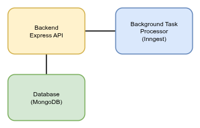

# TaskPilot Backend

A comprehensive Task management system with AI-powered ticket analysis, automatic assignment, and event-driven architecture.

## 🚀 Features

- **User Management**: Role-based authentication (Admin, Developer, Senior Developer)
- **Ticket Management**: CRUD operations with intelligent assignment
- **AI Integration**: Gemini AI for automatic ticket analysis and prioritization
- **Event-Driven Architecture**: Real-time notifications and background processing
- **Docker Containerization**: Easy deployment and development setup

## 🏗️ Architecture Overview



### Tech Stack

- **Runtime**: Node.js 22.16 (Alpine Linux)
- **Framework**: Express.js 5.1
- **Database**: MongoDB 8.18 with Mongoose ODM
- **Authentication**: JWT with HTTP-only cookies
- **Background Jobs**: Inngest 3.41
- **AI Integration**: Google Gemini API
- **Containerization**: Docker & Docker Compose

## 🛠️ Quick Start

### Prerequisites

- Docker & Docker Compose
- Node.js 18+ (for local development)
- Google Gemini API Key
- Discord Webhook URL (optional, for notifications)

### Environment Setup

1. **Clone and Setup**
   ```bash
   git clone <your-repo>
   cd TaskPilot/backend
   ```

2. **Environment Configuration**
   Create `.env` file in the backend directory:
   ```env
   # Database
   MONGO_URI=mongodb://db:27017/taskpilot

   # Authentication
   JWT_SECRET=your-super-secret-jwt-key-min-32-chars
   SALT_ROUNDS=12
   TOKEN_EXPIRES_IN=1h

   # Server
   PORT=7878
   API_VERSION=v1
   APP_URL=http://localhost:7878

   # AI Integration
   GEMINI_API_KEY=your-gemini-api-key

   # Notifications 
   DISCORD_WEBHOOK=https://discord.com/api/webhooks/your-webhook-url
   ```

3. **Start Services**
   ```bash
   docker-compose up -d
   ```

4. **Verify Installation**
   - Backend API: http://localhost:7878
   - Mongo Express: http://localhost:8081 (admin/admin123)
   - Inngest Dashboard: http://localhost:8288

## 📚 API Documentation

### Base URL
```
http://localhost:7878/api/v1
```

### Authentication

All protected endpoints require JWT token in HTTP-only cookie.

#### User Endpoints

| Method | Endpoint | Description | Access |
|--------|----------|-------------|---------|
| POST | `/users/signup` | User registration | Public |
| POST | `/users/signin` | User login | Public |
| POST | `/users/signout` | User logout | Authenticated |
| GET | `/users/profile` | Get user profile | Authenticated |
| PUT | `/users/profile?userId=:id` | Update user profile | Self/Admin |
| GET | `/users` | List users with filters | Authenticated |
| DELETE | `/users/delete/:userId` | Delete user | Admin Only |

#### Ticket Endpoints

| Method | Endpoint | Description | Access |
|--------|----------|-------------|---------|
| POST | `/tickets/add` | Create new ticket | Admin Only |
| GET | `/tickets` | List tickets with filters | Authenticated |
| GET | `/tickets/details?ticketId=:id` | Get ticket by ID | Authenticated |
| PUT | `/tickets/update?ticketId=:id` | Update ticket | Creator/Assignee/Admin |
| DELETE | `/tickets/delete/:ticketId` | Delete ticket | Admin Only |

### Request/Response Examples

#### User Registration
```bash
POST /api/v1/users/signup
Content-Type: application/json

{
  "name": "John Doe",
  "email": "john@example.com",
  "password": "securepassword123"
}
```

#### Create Ticket
```bash
POST /api/v1/tickets/add
Content-Type: application/json
Cookie: token=jwt-token

{
  "title": "Fix login authentication bug",
  "description": "Users cannot log in using email/password. Getting 'Cookie not found' error. Backend uses Flask, frontend uses React."
}
```

#### Update Ticket
```bash
PUT /api/v1/tickets/update?ticketId=507f1f77bcf86cd799439011
Content-Type: application/json
Cookie: token=jwt-token

{
  "state": "In Progress",
  "priority": "High",
  "assignedTo": "507f1f77bcf86cd799439012"
}
```

### Query Parameters

#### List Users
```bash
GET /api/v1/users?roles=admin,dev&skills=javascript,react&sortBy=createdAt&sortOrder=desc
```

#### List Tickets
```bash
GET /api/v1/tickets?state=In Progress&priority=High&sortBy=priority&sortOrder=asc
```

### User Roles & Permissions

| Role | Description | Permissions |
|------|-------------|-------------|
| **admin** | System administrator | Full access to all resources |
| **sdev** | Senior developer | Ticket updates, peer reviews |
| **dev** | Developer | Ticket updates, own profile |

### Ticket Workflow

```
Ready For Work → In Progress → Ready For Peer Review → In Peer Review → Peer Reviewed → Done
```

**State Transitions:**
- **Ready For Work**: Auto-assigned to ticket creator
- **In Progress**: Auto-assigned to available developer based on skills
- **In Peer Review**: Auto-assigned to senior developer for review
- **Peer Reviewed**: Automatically moves to "Done"

## 🤖 AI-Powered Features

### Automatic Ticket Analysis

When a ticket is created, Gemini AI analyzes it and automatically:

- **Sets Priority**: Critical, High, Medium, or Low
- **Calculates Deadline**: Based on complexity and priority
- **Generates Help Notes**: Actionable insights and investigation areas
- **Identifies Skills**: Required technical skills for assignment
- **Assigns Developer**: Matches skills with available developers

### Example AI Analysis

**Input Ticket:**
```json
{
  "title": "Database connection timeout",
  "description": "Users experiencing 5-second delays when loading dashboard. PostgreSQL queries timing out during peak hours."
}
```

**AI Output:**
```json
{
  "priority": "High",
  "deadline": "2025-09-28T00:00:00.000Z",
  "helpNotes": "Performance issue affecting user experience during peak traffic. Check PostgreSQL query execution plans, connection pool settings, and database indices. Monitor server resources and consider query optimization.",
  "relatedSkills": ["PostgreSQL", "Database Optimization", "Performance Tuning", "Monitoring", "SQL"]
}
```

## ⚡ Why Inngest Over Redis/BullMQ?

### Traditional Approach (Redis + BullMQ)
```javascript
// Complex setup required
const Queue = require('bull');
const emailQueue = new Queue('email queue', 'redis://127.0.0.1:6379');
const analysisQueue = new Queue('analysis queue', 'redis://127.0.0.1:6379');

// Manual error handling
emailQueue.process(async (job) => {
  try {
    await sendEmail(job.data);
    // Manual retry logic, error handling
  } catch (error) {
    throw error; // Hope the retry works
  }
});
```

### Inngest Approach
```javascript
// Simple, type-safe event handling
export const onUserSignup = inngest.createFunction(
  { id: "on-user-signup", retries: 2 },
  { event: "user.signup" },
  async ({ event, step }) => {
    const user = await step.run("get-user", async () => {
      return await User.findOne({ email: event.data.email });
    });
    
    await step.run("send-notification", async () => {
      await sendDiscordNotification(`New user: ${user.email}`);
    });
  }
);
```


### Docker Development

```bash
# Start all services
docker-compose up -d

# View logs
docker-compose logs -f backend

# Stop services
docker-compose down

# Rebuild after changes
docker-compose up -d --build
```

## 📊 Database Schema

### Users Collection
```javascript
{
  _id: ObjectId,
  name: String,
  email: String, // unique
  password: String, // hashed with bcrypt
  role: String, // "admin" | "dev" | "sdev"
  skills: [String],
  createdAt: Date,
  updatedAt: Date
}
```

### Tickets Collection
```javascript
{
  _id: ObjectId,
  title: String,
  description: String,
  state: String, // "Ready For Work" | "In Progress" | "Ready For Peer Review" | "In Peer Review" | "Peer Reviewed" | "Done"
  createdBy: ObjectId, // User reference
  assignedTo: ObjectId, // User reference
  priority: String, // "Low" | "Medium" | "High" | "Critical"
  deadline: Date,
  helpNotes: String,
  relatedSkills: [String],
  createdAt: Date,
  updatedAt: Date
}
```

## 🚦 Testing

### API Testing with cURL

```bash
# Register user
curl -X POST http://localhost:7878/api/v1/users/signup \
  -H "Content-Type: application/json" \
  -d '{"name":"John Doe","email":"john@test.com","password":"password123"}' \
  -c cookies.txt

# Login (using saved cookies)
curl -X POST http://localhost:7878/api/v1/users/signin \
  -H "Content-Type: application/json" \
  -d '{"email":"john@test.com","password":"password123"}' \
  -b cookies.txt -c cookies.txt

# Create ticket (Admin only)
curl -X POST http://localhost:7878/api/v1/tickets/add \
  -H "Content-Type: application/json" \
  -d '{"title":"Test Ticket","description":"Testing API"}' \
  -b cookies.txt

# Get tickets
curl -X GET http://localhost:7878/api/v1/tickets \
  -b cookies.txt
```

## 🤝 Contributing

1. Fork the repository
2. Create feature branch: `git checkout -b feature/new-feature`
3. Commit changes: `git commit -am 'Add new feature'`
4. Push to branch: `git push origin feature/new-feature`
5. Submit pull request

## 📄 License

This project is licensed under the ISC License.

## 📞 Support

For issues and questions:
- Create an issue on GitHub
- Check the troubleshooting section
- Review API documentation

## 🔍 Troubleshooting

### Common Issues

**1. Database Connection Failed**
```bash
# Check MongoDB container
docker-compose logs db

# Restart database
docker-compose restart db
```

**2. Inngest Events Not Processing**
```bash
# Check Inngest container
docker-compose logs inngest

# Verify environment variables
echo $INNGEST_BASE_URL
```

**3. JWT Token Errors**
```bash
# Check JWT secret configuration
echo $JWT_SECRET

# Clear browser cookies
# Update JWT_SECRET in .env
```

**4. AI Analysis Failing**
```bash
# Verify Gemini API key
echo $GEMINI_API_KEY

# Check Gemini API quota
# Review function logs in Inngest dashboard
```